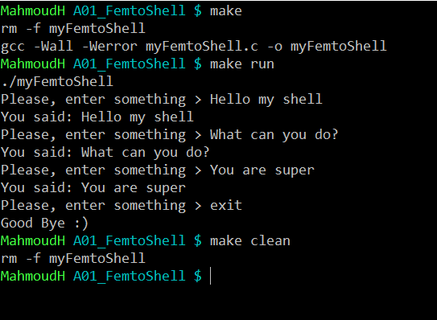

# Assignment #1: Femto Shell

## Contents:

* [Requirements](#requirements)

* [How to run](how-to-run?)

---

## Requirements

Write a femto shell program in **c language** that echoes any command entered by the user. The shell will have only one built-in command "exit". If the user entered "exit", the shell will reply with "Good Bye" and terminate.


> Here is an example:

```
$ ./myFemtoShell
Ana Gahez ya Basha > Hello my shell
You said: Hello my shell
Ana Gahez ya Basha > what can you do?
You said: what can you do?
Ana Gahez ya Basha > You are super
You said: You are super
Ana Gahez ya Basha > exit
Good Bye :)
$
```

---

## How to run?



---

