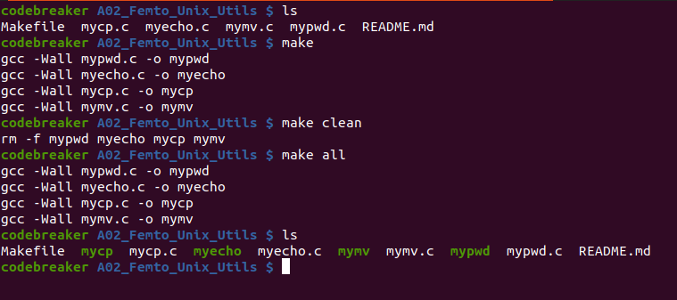
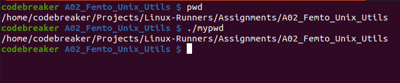
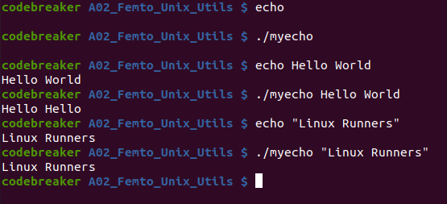
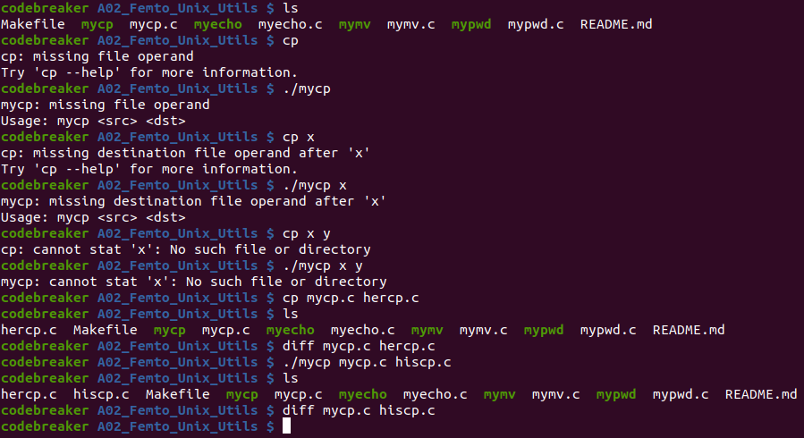
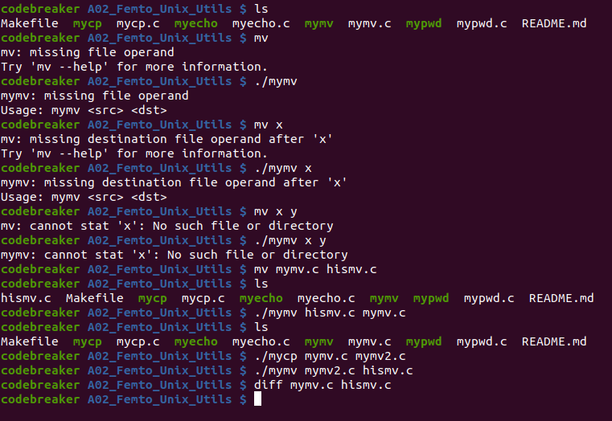

# Assignment #2: Femto Unix Utilities (pwd, echo, cp, mv)

## Contents:

* [Requirements](#requirements)

* [How to run?](#how-to-run)

---

## Requirements

### Write the following simple unix  utilities:

1. pwd: print working directory (check `man getcwd`)

2. echo: print a user input string on stdout (for example:  `echo Hello World`)

3. cp: copy a file to another file and keep the original one (equivalent to copy/paste)

4. mv: move a file to another file and remove the original one (equivalent to cut/paste) (check `man remove`).

### Important notes:

1. Check on the return values of the system calls / library routines you will use.

2. Each utility is a separate program (separate c file).

---

## How to run?

### Compile or Clean (using the given Makefile)

### 1) mypwd

### 2) myecho

### 3) mycp

### 4) mymv

---

